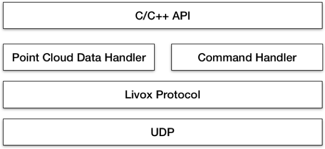
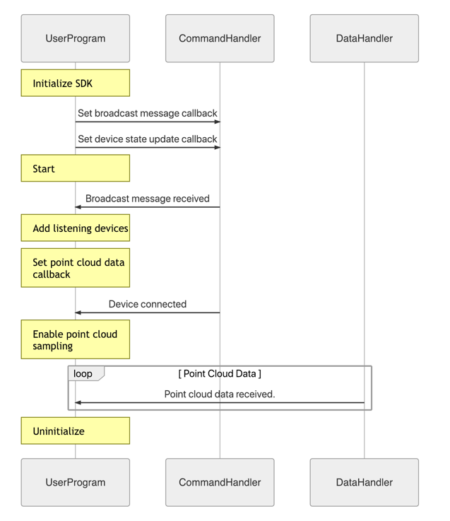
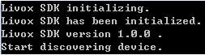

[README](<https://github.com/Livox-SDK/Livox-SDK/blob/master/README.md>) - English Version of the README
# 1 简介

Livox SDK 是为 Livox 公司旗下所有产品设计的软件开发套件。它基于 C/C++ 语言开发，遵循 Livox SDK 通信协议，并为用户提供了易用的 C 语言风格的接口。通过 Livox SDK，用户可以快速地连接 Livox 产品并接收点云数据。

Livox SDK 包括了 Livox SDK 通信协议，Livox SDK 内核，Livox SDK 应用接口，Windows/Linux 示例以及 ROS 示例。

## 前置依赖
* Ubuntu 14.04/Ubuntu 16.04/Ubuntu 18.04, x86 和 ARM (Nvidia TX2)
* Windows 7/10, Visual Studio 2015 Update3/2017/2019
* C++11 编译器

# 2 Livox SDK 通信协议

Livox SDK 通信协议对所有用户开放. 它定义了用户应用程序和 Livox 产品之间的通信协议. 协议内容包含了控制命令和点云数据格式。有关协议更详细的信息请查阅 [Livox SDK Communication Protocol](<https://github.com/Livox-SDK/Livox-SDK/wiki/Livox-SDK-Communication-Protocol>) 。

# 3 Livox SDK 内核

Livox SDK 提供了控制指令和点云数据传输的实现，以及提供了 C/C++ 应用接口。Livox SDK 内核的基本架构如下图所示 : 



UDP 协议被用于 Livox SDK 和 LiDAR 传感器之间的通信。请参照 Livox SDK 通信协议了解更多的信息. Point cloud data handler 负责点云数据传输，command handler 负责接收和发送控制指令。  C/C++ API 的实现基于 command handler 和 point cloud data handler。

Livox LiDAR 传感器可以直接连接主机或者通过 Livox Hub 连接到主机，Livox SDK 支持了以上两种连接方式。当 LiDAR 直接连接到主机，主机会与每个 LiDAR 都各自通信，如果 LiDAR 通过 Hub 连接到主机，主机仅与 Livox Hub 通信，Hub 再与每个 LiDAR 进行通信。

# 4 Livox SDK 应用接口

Livox SDK 应用接口提供了一系列 C 风格的接口，可以很方便地集成进 C/C++ 程序。请查阅 [Livox SDK API Reference](https://livox-sdk.github.io/Livox-SDK-Doc/) 获取更多信息。

## 4.1 安装
以下将介绍 Ubuntu 18.04/16.04/14.04 LTS 系统、 Windows 7/10 系统和 ARM-Linux 交叉编译的安装过程. 对于 Ubuntu 18.04/16.04/14.04 32-bit LTS 和 Mac 系统, 您可以查阅 [Livox-SDK wiki](https://github.com/Livox-SDK/Livox-SDK/wiki)。
### 4.1.1 Ubuntu 18.04/16.04/14.04 LTS
#### 依赖
Livox SDK 依赖于 cmake 。你可以通过 apt 工具安装这些依赖包 :
```
sudo apt install cmake
```
#### 编译 Livox SDK

在 Livox SDK 目录中，执行以下指令编译工程:
```
git clone https://github.com/Livox-SDK/Livox-SDK.git
cd Livox-SDK
cd build && cmake ..
make
sudo make install
```

### 4.1.2 Windows 7/10

#### 依赖
Livox SDK 支持 Visual Studio 2015 Update3/2017/2019，需要安装 [CMake 3.0.0+](https://cmake.org/) 依赖。

在 Livox SDK 目录中，执行以下指令生成 Visual Studio solution 文件。
生成 32-bit 工程：

```
cd Livox-SDK/build
```

对于 Viusal Studio 2015 Update3/2017:

```
cmake ..
```
对于 Viusal Studio 2019:
```
cmake .. -G "Visual Studio 16 2019" -A Win32
```
生成 64-bit 工程：
```
cd Livox-SDK/build
```
对于 Viusal Studio 2015 Update3:
```
cmake .. -G "Visual Studio 14 2015 Win64"
```
对于 Viusal Studio 2017:
```
cmake .. -G "Visual Studio 15 2017 Win64"
```
对于 Viusal Studio 2019:
```
cmake .. -G "Visual Studio 16 2019" -A x64
```
#### 编译 Livox SDK
然后就可以在 Visual Studio 中编译 Livox SDK 。

### 4.1.3 ARM-Linux 交叉编译

以下将介绍 ARM-Linux 的交叉编译过程。

#### 依赖

交叉编译需要在主机安装 cmake。 你可以通过 apt 工具安装这些依赖包 :

```
sudo apt install cmake
```

#### 交叉编译工具链

如果你的 ARM 板厂商提供了交叉编译工具链，则可以跳过以下交叉编译工具链的安装步骤，采用厂商提供的交叉编译工具链。

以下的指令分别对应 32bit 和 64bit ARM 板的 C 和 C++ 的交叉编译工具链的安装。你需要根据你 ARM 板的类型正确地安装交叉编译工具链，如果你的 ARM 板是 64bit SoC 架构，只需要安装 64bit 交叉编译工具链，如果你的 ARM板是 32bit SoC 架构，只需要安装 32bit 的交叉编译工具链。

安装 **ARM 32 bits 交叉编译工具链**：

```
 sudo apt-get install gcc-arm-linux-gnueabi g++-arm-linux-gnueabi
```

安装 **ARM 64 bits 交叉编译工具链**：

```
sudo apt-get install gcc-aarch64-linux-gnu g++-aarch64-linux-gnu
```

#### 交叉编译 Livox-SDK

以 **ARM 32 bits 交叉编译工具链**为例，在 Livox SDK 目录中，执行以下指令交叉编译工程：

```
cd Livox-SDK
cd build && \
cmake .. -DCMAKE_SYSTEM_NAME=Linux -DCMAKE_C_COMPILER=arm-linux-gnueabi-gcc -DCMAKE_CXX_COMPILER=arm-linux-gnueabi-g++
make
```

以 **ARM 64 bits 交叉编译工具链**为例，在 Livox SDK 目录中，执行以下指令交叉编译工程：

```
cd Livox-SDK
cd build && \
cmake .. -DCMAKE_SYSTEM_NAME=Linux -DCMAKE_C_COMPILER=aarch64-linux-gnu-gcc -DCMAKE_CXX_COMPILER=aarch64-linux-gnu-g++
make
```

**注意:**

-  gcc交叉编译器的版本需要支持 C ++11 标准

## 4.2 运行 Livox SDK 样例

Livox SDK 中提供了两种类型的示例 : Sample/Lidar 和 Sample/Hub, 分别展示了 Livox SDK 直接连接 Livox LiDAR 和通过 Livox Hub 连接的情况下，如何配置 Livox 雷达和接收点云数据。Sample 运行的时序如下图所示 ：



### 4.2.1 Ubuntu 18.04/16.04 /14.04 LTS
对于 Ubuntu 18.04/16.04/14.04 LTS 系统，如果直接连接 Livox LiDAR，则运行 *lidar_sample* ：
```
cd sample/lidar && ./lidar_sample
```
或者如果通过 Livox Hub 连接雷达，则运行 *hub_sample* :
```
cd sample/hub && ./hub_sample
```
### 4.2.2 Windows 7/10
在完成 4.1.2 章节中 Livox SDK 编译后，你可以分别在 {Livox-SDK}\build\sample\hub\Debug 或者 {Livox-SDK}\build\sample\lidar\Debug 文件夹中找到 `hub_sample.exe` 或者 `lidar_sample.exe` 。

直接运行以上的程序，然后你就可以看到以下信息:



### 4.3 连接指定的 LiDAR

默认情况下，我们提供的 Samples 会连接局域网络中的所有广播设备。有两种方式可以连接指定的 LiDAR 设备

* 运行 sample 并指定输入程序选项

* 在源代码中编辑 Broadcast Code list

**注意:**

每个 Livox LiDAR 都拥有一个唯一的广播码 。 广播码包含了序列号和一个额外的数字 (1,2, or 3)。序列号可以 LiDAR 机身找到 (在QR 码下面)。广播码在你想要连接指定的 LiDAR 时可能会用到.  具体的格式如下图所示 :


#### 4.3.1 程序选项

我们提供了以下程序选项去连接指定的设备和生成日志文件 :
```
[-c]:Register LiDAR units by Broadcast Code. Connect the registered units ONLY. 
[-l]:Save the log file(In the executable file's directory).
[-h]:Show help.
```
这里是示例 :
```
./lidar_sample_cc -c "00000000000002&00000000000003&00000000000004" -l
./hub_sample_cc -c "00000000000001" -l
```

#### 4.3.2 编辑广播码

注释以下的代码块：

```
/** Connect all the broadcast device. */
int lidar_count = 0;
char broadcast_code_list[kMaxLidarCount][kBroadcastCodeSize];
```

在编译前移除以下代码块的注释，并且替换 broadcast code lists 为你指定的LiDAR 的广播码，对于 LiDAR sample ({Livox-SDK}/sample/lidar/main.c) 和 Hub sample ({Livox-SDK}/sample/hub/main.c)，设置 BROADCAST_CODE_LIST_SIZE 并且替换 在`main.c`  的 broadcast code lists。

```
/** Connect the broadcast device in list, please input the broadcast code and modify the BROADCAST_CODE_LIST_SIZE. */
/*#define BROADCAST_CODE_LIST_SIZE  3
int lidar_count = BROADCAST_CODE_LIST_SIZE;
char broadcast_code_list[kMaxLidarCount][kBroadcastCodeSize] = {
  "000000000000002",
  "000000000000003",
  "000000000000004"
};*/
```

### 4.4 生成 lvx 文件

我们为 Hub 连接和 LiDAR 直连的方式都提供了 C++ 生成 lvx 文件示例. 你可以通过 `4.2.1` and `4.2.2` 中描述的相同方式去运行它们。

#### 4.4.1 程序选项

你可以使用  `4.3.1`  提到的程序选项去连接指定的设备和生成日志文件, 我们为 lvx 文件提供了两个新的选项:
```
[-t] Time to save point cloud to the lvx file.(unit: s)
[-p] Get the extrinsic parameter from standard extrinsic.xml file(The same as viewer) in the executable file's directory.(Especially for LiDAR unit(s) as the hub will calculate the extrinsic parameter by itself)
```
这里是示例 :
```
./lidar_lvx_sample -c "00000000000002&00000000000003&00000000000004" -l -t 10 -p
./hub_lvx_sample -c "00000000000001" -l -t 10
```

# 5 支持

你可以通过以下方式获取 Livox 的技术支持 :
* 发送邮件到 dev@livoxtech.com 描述清楚问题和使用场景
* Github Issues
